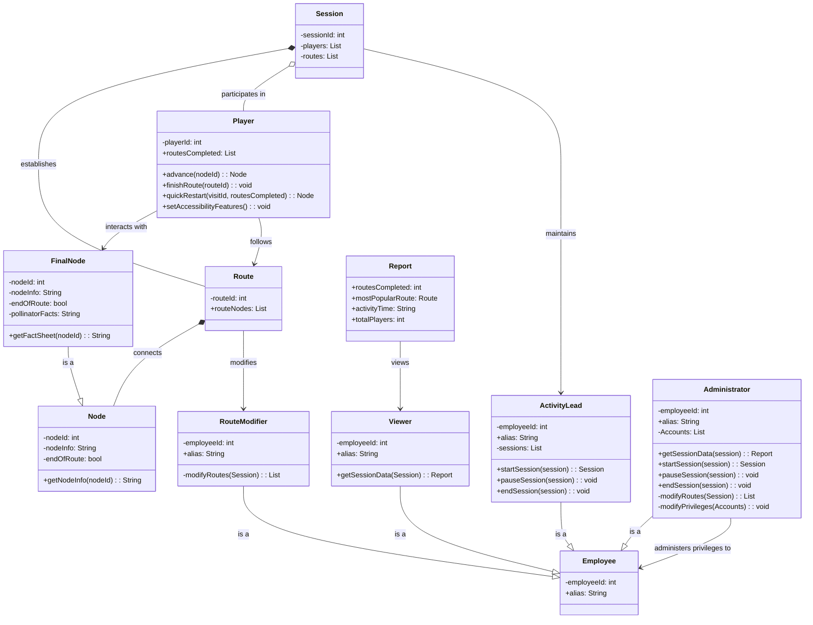

```mermaid
classDiagram
    class Node{
        -nodeId: int
        -nodeInfo: String
        -endOfRoute: bool
        +getNodeInfo(nodeId): String
    }

    class FinalNode{
        -nodeId: int
        -nodeInfo: String
        -endOfRoute: bool
        -pollinatorFacts: String
        +getFactSheet(nodeId): String
    }

    class Route{
        -routeId: int
        +routeNodes: List<Node>
    }

     class Player{
        -playerId: int 
        +routesCompleted: List<Route>
        +advance(nodeId): Node
        +finishRoute(routeId): void
        +quickRestart(visitId, routesCompleted): Node
        +setAccessibilityFeatures(): void
    }

    class Session{
        -sessionId: int
        -players: List<Player>
        -routes: List<Route>
    }
    
    class Report {
        +routesCompleted: int
        +mostPopularRoute: Route
        +activityTime: String
        +totalPlayers: int
    }

    class Employee {
        -employeeId: int
        +alias: String
    }
    
    class Viewer {
        -employeeId: int
        +alias: String
        +getSessionData(Session): Report
    }

    class ActivityLead {
        -employeeId: int
        +alias: String
        -sessions: List<Session>
        +startSession(session): Session
        +pauseSession(session): void
        +endSession(session): void
    }

    class RouteModifier {
        -employeeId: int
        +alias: String
        -modifyRoutes(Session): List<Route>
    }

    class Administrator {
        -employeeId: int
        +alias: String
        -Accounts: List<Employee>
        +getSessionData(session): Report
        +startSession(session): Session
        +pauseSession(session): void
        +endSession(session): void
        -modifyRoutes(Session): List<Route>
        -modifyPrivileges(Accounts): void
    }

Player --> FinalNode : interacts with
Route *-- Node : connects
Player --> Route : follows
FinalNode --|> Node : is a
Session *-- Route : establishes
Session o-- Player : participates in
Session --> ActivityLead : maintains
Report --> Viewer : views
Route --> RouteModifier : modifies 
Administrator --|> Employee : is a
Viewer --|> Employee : is a
ActivityLead --|> Employee : is a
RouteModifier --|> Employee: is a
Administrator --> Employee: administers privileges to
```