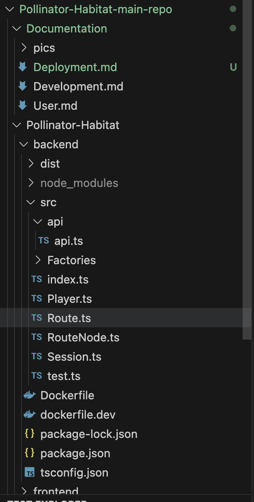
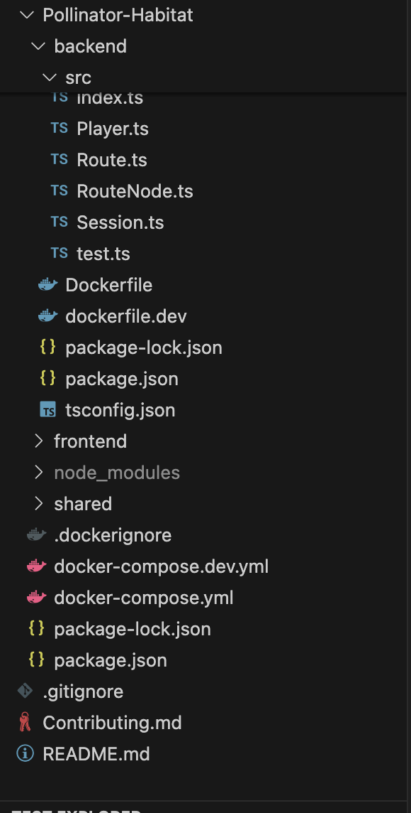

## Deploying the Pollinator Habitat Application

#### Prerequisites 
What needs to be installed before starting:

### Server Requirements
- **Operating System:** Linux (Any Linux LTS that is still supported) or macOS  
- **CPU:** Dual-core or better  
- **RAM:** Minimum 4 GB (16 GB recommended for Docker)  
- **Storage:** 30 GB free disk space  
- **Network:** internet access to install Node modules and Docker images
- **Database:** Mysql database for Future Iterations

firewall ports 3000 and 4000 need to be open and enable SSH for remote access to server. 
Recommended deployment environment is a machine running this in Docker. 


## Docker Memory Allocation (macOS & Windows)

Docker Desktop limits RAM 

Recommended:
- Minimum: 4 GB allocated to Docker
- Preferred: 8 GB or higher 

How to change memory settings in Docker Desktop:

macOS / Windows:
1. Open Docker Desktop
2. Go to Settings (or Preferences on macOS)
3. Select Resources
4. Increase Memory slider to 4–8 GB
5. Apply & Restart
##### Your local machine. 
1.  Install Node.js 24.11.0 LTS and npm from [https://nodejs.org/en/](https://nodejs.org/en/) (Application will be tested with each new LTS)
    
    
2.  Ensure you can SSH into a remote server.
    
3.  Clone the driver app repository into a folder of your choosing (preferably where you won't have to change permissions)
    
4.  Using Terminal or PowerShell (depending on your operating system), navigate inside of project folder and run (with sudo if using linux) 
```sh
npm install 
```
inside the root of the project folder and the backend folder and the frontend folders. 
    

This will install all of the project dependencies into a “node modules” folder in the project root. (Ensure this folder exists before moving forward)

It is likely that you will have a newer version of React and other packages than the version in the package.json files (where all dependencacies are specified for the project) so stick with the older version.

### Building and Compiling

##### Set Any Environment Dependent Variables Before Deploying
never modify inside node_modules and no environmental variables need to be changed.

###### Authentication API Endpoint
None 
###### API Base Url
http://localhost:4000/api 

##### Test Before Deployment


### File and Folder Placement
Clone the repository into `/opt/pollinator-habitat` (Linux) or `~/Documents/Pollinator-Habitat` (macOS/Windows).  Might require sudo in Linux and Unix like Systems and Admin rights on Windows
Ensure the folder structure matches this layout:


Do NOT move the frontend or backend out of the Pollinator-Habitat folder it will cause it not to work with docker. 

##### Build and Compile without Docker


Our React and Node.js project gets transpiled into javascript the browser can handle. We need to perform these actions and get them uploaded to a web server.

Using Terminal or PowerShell (depending on your operating system), navigate inside of project folder and run


```sh


npm run build --prefix frontend
npm start --prefix frontend
npm run build --prefix backend
npm start --prefix backend
```

### Starting and stopping the webserver. 
Close the terminal windows or issue a sudo pkill for the ip port used for the two services. backend is port 4000 and frontend is 8080 


# Administrator Dashboard
To be added in future Iteration. 
# Final Result


Project Structure should look like this. 


# 🐳 Installing and Setting Up Docker for Development
run docker compose files from root of the project. 

Follow these steps to install and configure **Docker Desktop** or **Docker Engine** for your local development environment.

---

## 1. Check for Existing Installation

Before installing, check if Docker is already installed:

```bash
docker --version
docker compose version
```

# Docker Development Container Setup 


To build and run containers issue this command from the root of the project 

```sh
docker compose -f docker-compose.dev.yml build
docker compose -f docker-compose.dev.yml up

```
Or to rebuild automatically on changes:
```sh

docker compose -f docker-compose.dev.yml up --build

```

frontend runs on → http://localhost:3000
Backend runs on → http://localhost:4000 
to stop containers 

```sh

docker compose -f docker-compose.dev.yml down

```

# Docker Production Container Setup 

To build and run containers issue this command from the root of the project 

```sh
docker compose -f docker-compose.yml build
docker compose -f docker-compose.yml up

```
Or to rebuild automatically on changes:
```sh

docker compose -f docker-compose.yml up --build

```

frontend runs on → http://localhost:3000
Backend runs on → http://localhost:4000 
to stop containers 

```sh

docker compose -f docker-compose.yml down

```
# Errors, Troubleshooting, and Maintenance Guide

This short guide explains how to fix the most common problems and keep the Pollinator Habitat web application running smoothly.

---

## Common Issues

### 1. Missing Dependencies
If you see errors like “module not found” or “cannot find module”:
```bash
npm install
```
If the app fails to start and you see:
Error: listen EADDRINUSE
It means something is already using that port.
To fix:
Kill node if not try a new port. 
```bash
sudo pkill -f node
PORT=5000 npm start --prefix backend

```
### production start/stop ###
```sh
docker compose -f docker-compose.yml up
docker compose -f docker-compose.yml down

```
### Docker Troubleshooting 
Common causes:
- Missing dependencies
- Incorrect folder structure
- Port already in use
- Backend cannot bind to port 4000
- Frontend cannot reach backend API

Fix port issues:
sudo pkill -f node
lsof -i :3000
lsof -i :4000

---

#### Failing Builds

Rebuild (Development) without cache:
docker compose -f docker-compose.dev.yml build --no-cache

Rebuild and run (Development):
docker compose -f docker-compose.dev.yml up --build

Rebuild (Production) without cache:
docker compose -f docker-compose.yml build --no-cache

Rebuild and run (Production):
docker compose -f docker-compose.yml up --build

If frontend fails:
- Delete “node_modules” inside /frontend
- Run: npm install --prefix frontend

If backend fails:
- Delete “node_modules” inside /backend
- Run: npm install --prefix backend

---

#### Check If Services Are Actually Running
docker ps


#### Quick Health Check


Frontend:
Open in browser:
http://localhost:3000

##  Where Logs Are Found
### 1. Docker Logs

Development containers:
docker compose -f docker-compose.dev.yml logs -f

Production containers:
docker compose -f docker-compose.yml logs -f

Specific service:
docker compose -f docker-compose.dev.yml logs -f backend
docker compose -f docker-compose.dev.yml logs -f frontend

---
### 2. Backend Logs (Manual Run)

Start backend manually:
npm start --prefix backend
Backend errors show directly in the terminal:
### 3. Frontend Build Logs

Build frontend manually:
npm run build --prefix frontend

Start frontend manually:
npm start --prefix frontend
## What are the most critical pieces that can fail
Database (if used)

Environment variables when used

Backend API crash

Frontend build errors

Missing Node version match

Docker image build failures
