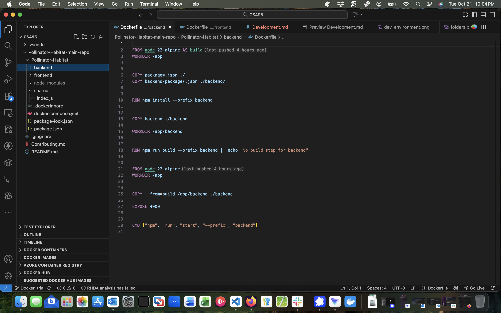
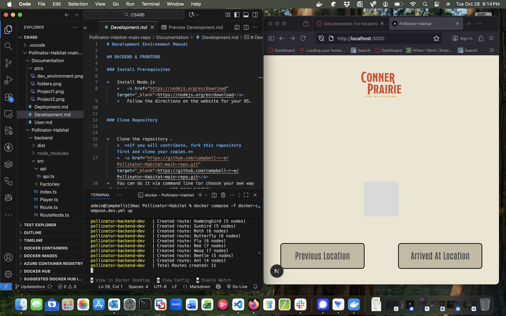

# Development Environment Manual

## System Overview / Tech Stack Explanation

The system uses React for the Front-End which is the user facing system and it requests and processes data from the Back-end to show the user and the backend will eventually rettrieve polinator data from the MySQL database. 
## Required Tools & Technologies
Node.js 24.11,Git,VSCode,Docker desktop and engine,Containers Extention,NPM that comes with node.js
containers extention makes it easier to run containers. 

You should VSCode with typescript/javascript extentions as well as have git installed and VScode is recomended due to ease of use. 
## BACKEND & FRONTEND 
### Folder Structure Explanation and important files
```text
┣ 📂Documentation // Folder Containing Documentation 
┃ ┣ 📂pics // Folder of images used by the Project
┃ ┃ ┣ 📜dev_environment.png
┃ ┃ ┣ 📜folders.png
┃ ┃ ┣ 📜Pollinator_6_Legs.png
┃ ┃ ┣ 📜PollinatorArrivedAtLocation.png
┃ ┃ ┣ 📜PollinatorStart.png
┃ ┃ ┣ 📜Project1.png
┃ ┃ ┗ 📜Project2.png
┃ ┣ 📜Contributing.md
┃ ┣ 📜Deployment.md
┃ ┣ 📜Development.md
┃ ┣ 📜README.md
┃ ┗ 📜User.md
┣ 📂Pollinator-Habitat // Root of the Monolith Project
┃ ┣ 📂backend  // Root of the Backend Project
┃ ┃ ┣ 📂prisma // Folder for Database Schema when database will be used 
┃ ┃ ┃ ┗ 📜schema.prisma // Schema file used to define structure of database with prisma
┃ ┃ ┣ 📂src // Folder with Backend Source code such as main server file and other classes and API's
┃ ┃ ┃ ┣ 📂api // API's folder currentl all API's are in one file 
┃ ┃ ┃ ┃ ┗ 📜api.ts 
┃ ┃ ┃ ┣ 📂Factories // folder with json data for polinators and classes to read it. 
┃ ┃ ┃ ┃ ┣ 📜FactNodeFactory.ts 
┃ ┃ ┃ ┃ ┣ 📜FactNodes.json
┃ ┃ ┃ ┃ ┣ 📜RouteFactory.ts
┃ ┃ ┃ ┃ ┣ 📜RouteNodeFactory.ts
┃ ┃ ┃ ┃ ┣ 📜RouteNodes.json
┃ ┃ ┃ ┃ ┗ 📜Routes.json
┃ ┃ ┃ ┣ 📜FactNode.ts
┃ ┃ ┃ ┣ 📜index.ts // Main server file 
┃ ┃ ┃ ┣ 📜Player.ts
┃ ┃ ┃ ┣ 📜Route.ts
┃ ┃ ┃ ┣ 📜RouteNode.ts
┃ ┃ ┃ ┣ 📜Session.ts
┃ ┃ ┃ ┣ 📜Start.ts
┃ ┃ ┃ ┗ 📜test.ts
┃ ┃ ┣ 📂testing // Folder for Backend tests
┃ ┃ ┃ ┗ 📜RouteNode.test.js
┃ ┃ ┣ 📜.gitignore // file defining what files should not be tracked by git
┃ ┃ ┣ 📜Dockerfile //production docker file to create container
┃ ┃ ┣ 📜dockerfile.dev // Development Docker file to create contianer for devs
┃ ┃ ┣ 📜package.json // Defines the packages used by the backend project
┃ ┃ ┣ 📜prisma.config.ts // config file for prisma the orm 
┃ ┃ ┗ 📜tsconfig.json // Typescript configuration file for backend 
┃ ┣ 📂frontend
┃ ┃ ┣ 📂public // Folder for public static files
┃ ┃ ┃ ┣ 📂fonts // Folder for Fonts 
┃ ┃ ┃ ┃ ┗ 📜Antonio-Regular.ttf
┃ ┃ ┃ ┣ 📂images // Folder for images used in project
┃ ┃ ┃ ┃ ┣ 📜CPLOGO.png
┃ ┃ ┃ ┃ ┣ 📜debug_spritesheet.png
┃ ┃ ┃ ┃ ┗ 📜placeholder.png
┃ ┃ ┃ ┗ 📜favicon.ico
┃ ┃ ┣ 📂src // Front-end source code folder 
┃ ┃ ┃ ┣ 📂app // folder containing folders of pages and css.
┃ ┃ ┃ ┃ ┣ 📂accessibility // accessibility page folder 
┃ ┃ ┃ ┃ ┃ ┗ 📜page.tsx
┃ ┃ ┃ ┃ ┣ 📂home // home page folder
┃ ┃ ┃ ┃ ┃ ┗ 📜page.tsx
┃ ┃ ┃ ┃ ┣ 📂route // route page 
┃ ┃ ┃ ┃ ┃ ┗ 📜page.tsx
┃ ┃ ┃ ┃ ┣ 📜components.tsx
┃ ┃ ┃ ┃ ┣ 📜globals.css
┃ ┃ ┃ ┃ ┣ 📜layout.tsx
┃ ┃ ┃ ┃ ┗ 📜page.tsx
┃ ┃ ┃ ┣ 📂utils // utiliites used in front-end
┃ ┃ ┃ ┃ ┗ 📜globalCSSValidator.js
┃ ┃ ┃ ┗ 📜global.d.ts
┃ ┃ ┣ 📂testing // front-end tests folder
┃ ┃ ┃ ┣ 📜Components.test.js
┃ ┃ ┃ ┗ 📜CSS-Utils.test.js
┃ ┃ ┣ 📜.gitignore // frontend files to ignore
┃ ┃ ┣ 📜Dockerfile // production docker file with configs to spin up container
┃ ┃ ┣ 📜dockerfile.dev // Development Docker file to define configs to spin up image
┃ ┃ ┣ 📜eslint.config.mjs // config file for eslint rules
┃ ┃ ┣ 📜next-env.d.ts // file for next.js environment 
┃ ┃ ┣ 📜next.config.mjs // next.js config file 
┃ ┃ ┣ 📜package.json // file contains packages list for front end 
┃ ┃ ┣ 📜postcss.config.mjs // css configuration 
┃ ┃ ┣ 📜README.md
┃ ┃ ┗ 📜tsconfig.json // Typescript configuration file for front end 
┃ ┣ 📂shared // folder of shared files between front-end and backend
┃ ┃ ┣ 📜index.js 
┃ ┃ ┣ 📜tsconfig.json // typescript config file for shared files
┃ ┃ ┗ 📜types.ts
┃ ┣ 📜.dockerignore // defines files for docker to not import into containers
┃ ┣ 📜docker-compose.dev.yml //dev file to spin up both front and back and database containers
┃ ┣ 📜docker-compose.yml // production file to spin both front and back and database
┃ ┣ 📜package.json // main package file for packages needed for both front and back-ends
┃ ┗ 📜tsconfig.base.json // base typescript configs for both front and backend
┣ 📜.gitignore // ignores files for git 
┣ 📜Contributing.md
┗ 📜README.md


```
### Tech-Stack ###
This project uses Next.JS and React for the Front-End and uses Node/Express for the Backend of the project. This project will use MySql for the Database but is currently not used.
You need Docker desktop to run this. 

### Install Prerequisites

*   Install Node.js
    *   <a href="https://nodejs.org/en/download" target="_blank">https://nodejs.org/en/download</a>
    *   Follow the directions on the website for your OS. 
      

### Clone Repository


*   Clone the repository .
    *  **If you will contribute, fork this repository first and clone your copies.**
    *  <a href="https://github.com/campbell-r-e/Pollinator-Habitat-main-repo.git" target="_blank">https://github.com/campbell-r-e/Pollinator-Habitat-main-repo.git</a>
*   You can do it via command line (or choose your own way of cloning a repository, NOT DOWNLOADING).  

    *   **Shift+Right-click** to an empty place on that folder to open a command line.
    *   Run these commands (it assumes you have **git** installed and **git** command accessible in PATH environment variable):
        *   <pre>git clone https://github.com/campbell-r-e/Pollinator-Habitat-main-repo.git </pre>
       

*   You must have the following folder structure if you did everything successfully.
    *   


### Test the Development Environment

*   Simply browse to <a href="  http://localhost:3000" target="_blank">http://localhost:3000</a>
*   You should see the following screen:
    *   
*   You will be able to play a game. 

## FRONTEND and Backend

### Installing Prerequisites

*   Install NodeJS (24.11.0 LTS is tested and confirmed to work.)
    *   <a href="https://nodejs.org/en/download" target="_blank">https://nodejs.org/en/download</a>

### Clone Repository

*   Clone the repository .
    *  **If you will contribute, fork this repository first and clone your copies.**
    *  <a href="https://github.com/campbell-r-e/Pollinator-Habitat-main-repo.git" target="_blank">https://github.com/campbell-r-e/Pollinator-Habitat-main-repo.git</a>
*   You can do it via command line (or choose your own way of cloning a repository, NOT DOWNLOADING).  

    *   **Shift+Right-click** to an empty place on that folder to open a command line.
    *   Run these commands (it assumes you have **git** installed and **git** command accessible in PATH environment variable):
        *   <pre>git clone https://github.com/campbell-r-e/Pollinator-Habitat-main-repo.git </pre>
       

*   You must have the following folder structure if you did everything successfully.
    *   


### Install Dependencies

*   Install dependencies by running the command below.
    *   <pre>npm install in the front and backend folders as well as root</pre>

    *   This might take some time.
  

### Run the App


    
*   Run the app by running the command below.
   1. npm install
   2. CD into Polinator-Habitat directory 
   3. Open 2 terminals, 1 for frontend commands and 1 for backend commands under the Polinator-Habitat directory.
   4. npm run build --prefix frontend
   5. npm start --prefix frontend
   6. npm run build --prefix backend
   7. npm start --prefix backend
   8. go to http://localhost:3000/ in a web browser


    
## Test the App (Simple integration testing) ##

* Go to http://localhost:3000 and you should the first title page. 


## Replicating via Docker 


### Docker Dev Setup ###
refer to  <a href="https://docs.docker.com/engine/install/" target="_blank">https://docs.docker.com/engine/install/</a>
for how to setup and install Docker.
This project is in two containers a front-end and a back-end container. 

1. CD into the Pollinator-Habitat folder
2. Enter    docker compose -f docker-compose.dev.yml build --no-cache
3. Enter    docker compose -f docker-compose.dev.yml up

To shutdown Containers docker compose -f docker-compose.dev.yml down 

### Docker Production Setup ###

refer to  <a href="https://docs.docker.com/engine/install/" target="_blank">https://docs.docker.com/engine/install/</a>
for how to setup and install Docker.
This project is in two containers a front-end and a back-end container. 
Docker Desktop app must be open to run it. 

1. CD into the Pollinator-Habitat folder
2. Enter    docker compose -f docker-compose.yml build --no-cache
3. Enter    docker compose -f docker-compose.yml up

To shutdown Containers docker compose -f docker-compose.yml down 

### Testing – How to Run Tests ### 

## Run All Tests

```
npm run test
```

## Run Tests With Coverage

```
npm run test:coverage
```

## Target-Specific Test Commands

Run tests for a specific area of the project:

```
npm run test:frontend
npm run test:backend
```

Run coverage for a specific target:

```
npm run test:coverage:frontend
npm run test:coverage:backend
```
All npm dependencies are chained properly so each command works across root, frontend, and backend.

## Docker – How to Verify It Worked

### Check running containers ###
docker ps

### Verify URL ###
http://localhost:3000


## Replicating the Development Environment with Docker

Docker lets you run the full development environment (frontend + backend +database) without installing Node.js or configuring anything manually. The `docker-compose.dev.yml` file builds both services front and back ends and database. 

### How It Works
- **Frontend container:** runs on **http://localhost:3000**
- **Backend container:** runs on **http://localhost:4000**
- Dependencies are installed inside the containers.
- Your local code is mounted into the containers so changes should update instantly.

### Start the Dev Environment
```bash
docker compose -f docker-compose.dev.yml build --no-cache
docker compose -f docker-compose.dev.yml up
```
 ## Testing – How to Interpret Results
