# User Documentation

## Overview

This application is designed to be your virtual fact sheet for **Conner Prairie's: *Pollinator Habitat*** Activity. When you begin, you will secretly be assigned a random pollinator. The purpose of the activity is to use **science** to figure out what polliator *you* are. 

This is completed by going through a small series of prompts ("I have 2 legs", "I have 4 wings") that you will follow along with by matching it with the clues on your screen (ex: 6 legs or elytra wings) 

At every prompt, you will use your pollinators physical characteristics to narrow down what type of pollinator you were secretly assigned (ex: "Bee", "Hummingbird").

Once you have ruled out any other type of pollinator, you will discover which one you were secretly assigned. You will then be presented unique facts about that particular pollinator, and its benefit to the ecosystem!

**Fun fact: The activity's series of questions are called a dichotomous key.**

You can learn more about dichotomous keys here: [biologydicionary.net](https://biologydicionary.net)

## Usage Guide: 

**Note:** Let the application load completely. You will know it is ready to use when you see the Conner Prairie logo.

Click the **'Home'** Button to go to the main menu. 

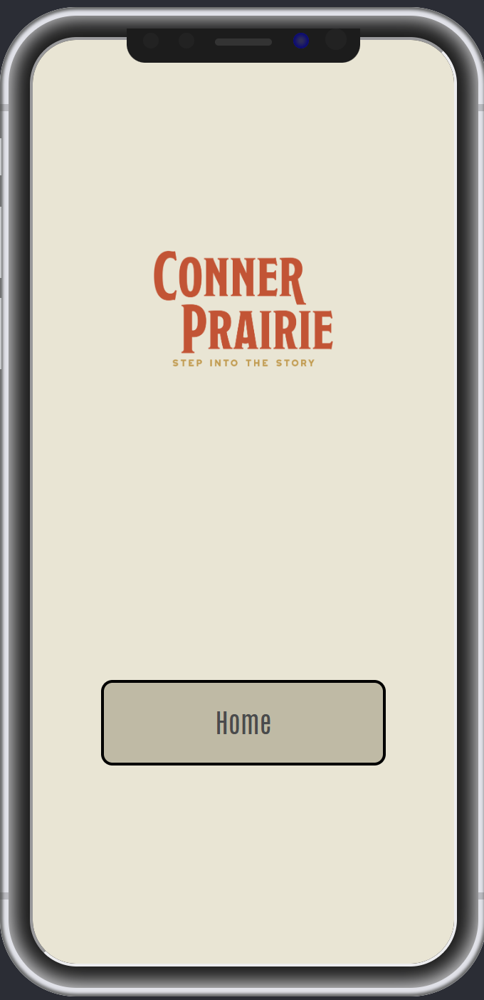

Once in the Main Menu, you should see three buttons:
1. Start New Pollinator Path
2. Accessibility
3. Pollinator Collection

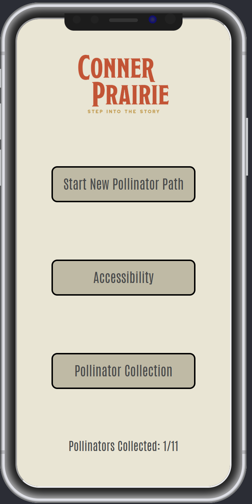

## Start New Pollinator Path 

To play the Pollinator Habitat Activity, press the 'Start New Pollinator Path' button.

When you see the word "Start" on your screen, you have successfully joined the activity and been assigned a secret pollinator. An example of this screen is shown in the picture below:

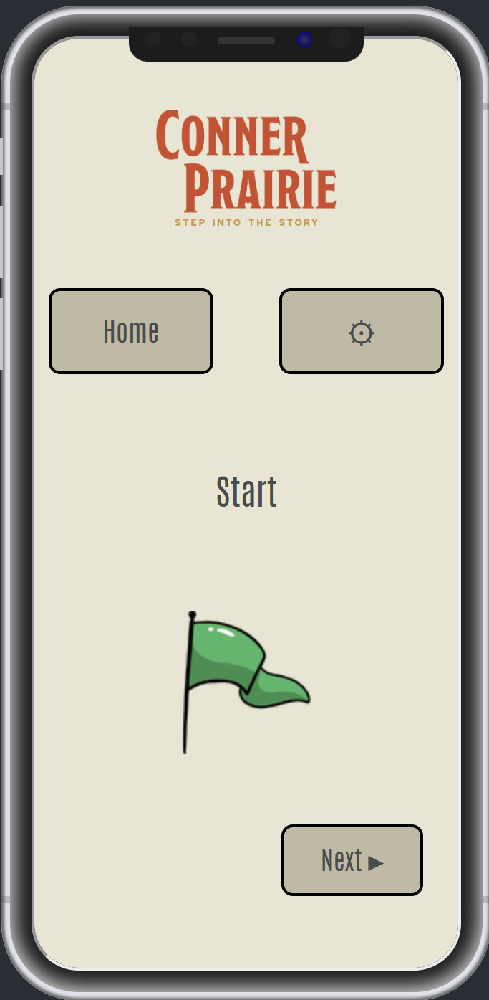

### 1: With Start on your screen, move to the Start Card along the ground. 

### 2: Once at the Start location, press the "Next" button to get your first pollinator clue. Then, move to the spot that matches your pollinator's clue. 
#### You can move back a step with the "Previous" button

#### Example: If your screen displays the clue "worker with no wings" move to the spot that has the "worker have no wings" marker. 

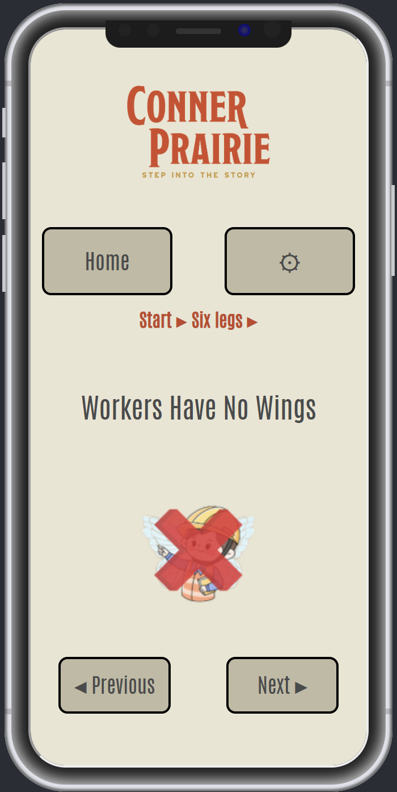

3: Once you arrive to the marked spot, press the "Next" button to move get your next fact so you can figure out where to go next. 

4: Follow along until you figure out your unique pollinator. You will then get to view several different facts about the pollinator. 

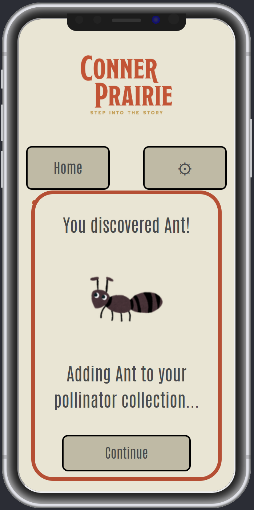

5: Once you have reach the final fact about about your pollinator, you can either restart the activity by pressing the "Start New Route" or return to the main menu by pressing "Home'.

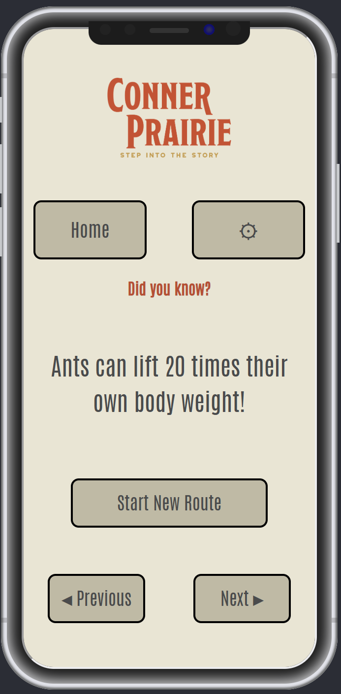

6: When a pollinator's route is completed, it is added to the user's Collection. Total pollinators can be seen in the main menu. 

8: When the final fact is displayed, the "next" button will disappear. This indicates Route conclusion. 

9: To restart the game, press the "Start New Route" button. 

### If playing the activity again, start again at step 1. 

At any point in the game, the user can go back to the home menu with "Home" button. 

## Accessibility Menu

Within the accessibility settings menu, there are a menu of settings that will facilitate user accessibility. From the main menu, tap "Accessibility Settings"

### Options to enable:
1. Click the checkbox next to "High Color Contrast"
    - While checked, the applications visual representation will utilize high contrast colors
    - The setting can be reverted by simply unchecking the box
2. Click the checkbox next to "Text-to-Speech" 
    - While checked, the TTS button will be available to during the route activity
3. Move the slider under "Text Size"
    - When moved, the text size for all text across the application will match the selected percent, ranging from 75% - 150%

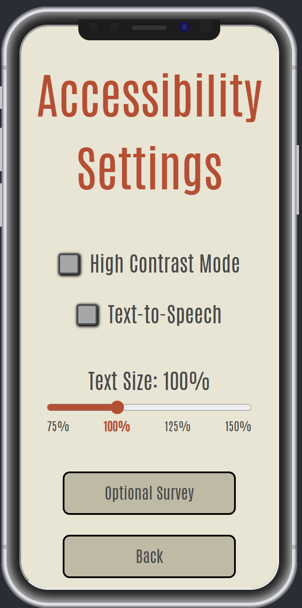

### Optional Survey
The user can submit the optional survey stating the number of children and adults using the application. Submitting the survey from the same device multiple times within a 24 hour window will simply replace previous submissions with the most recent survey answers.

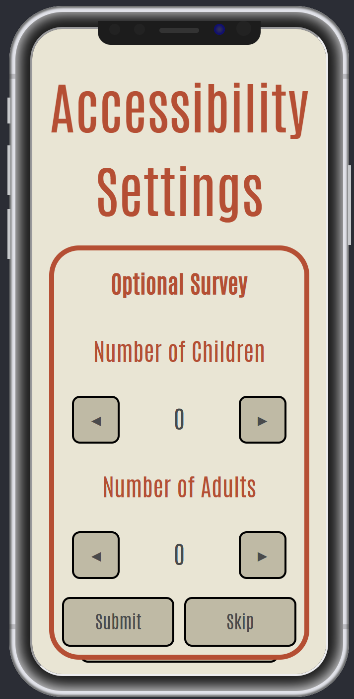

## Pollinator Collection 
### When the user finishes a polllinator's route and gets to the fact section:
- Pollinator is stored to users random playerId via JWT
- The pollinator is added to the "Discovered" section of the collection page
- The pollinator's image transforms from a silouette to a full color sprite
- The back button takes you back the home menu

### Replay
- After a pollinator is discovered, it can be replayed as many times as the user wishes by clicking the "Replay" button underneath the pollinator's name

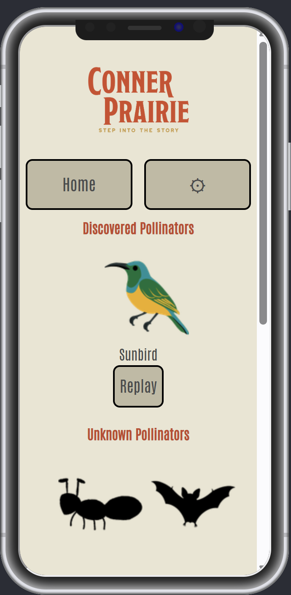

## Pollinator Habitat Admin Portal 
## Overview
The Conner Prairie Pollinator Habitat Portal is a lightweight application designed to allow the easy access to data from survey responses and general activity use. 

There are 3 tools within the Conner Prairie Pollinator Habitat Portal:
#### 1. Survey Response Data Search Tool
#### 2. Route Data Search Tool
#### 3. Quick Export Tool (Can be either Route or Survey Data)

The two data search tools provide a way to search for specific date export of survey data based on the search criteria. The quick export tool provides a quick way to get data reports for a chosen timespan (last 6 months) 

## Usage Guide: 

### Splash Page
The landing page of the application takes you to a disclosure prohibiting unauthorized use of the portal. It will look like the picture below:

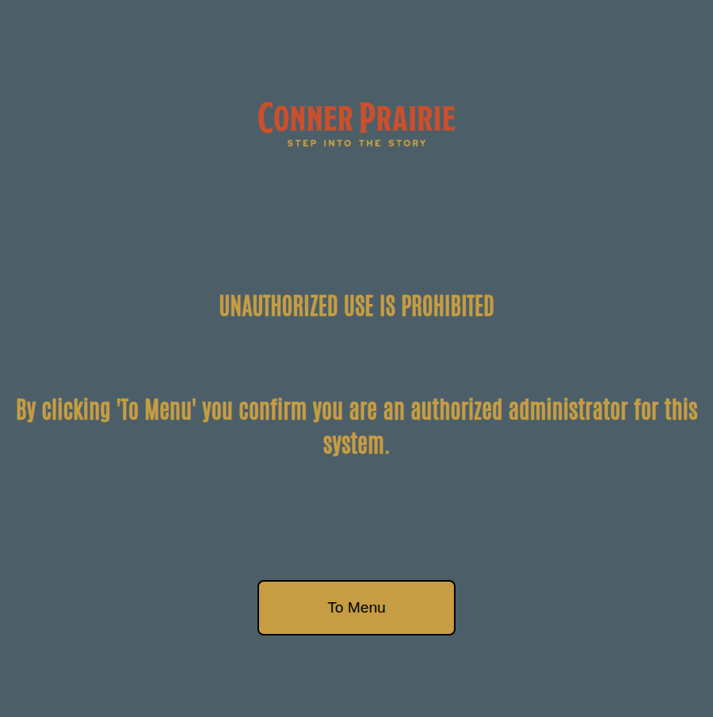

If you are an authorized administator for the system, click "To Menu" navigate to the main menu. 

### Menu Page 

The menu page will give you 3 options, matching the 3 tools in the overview section. 

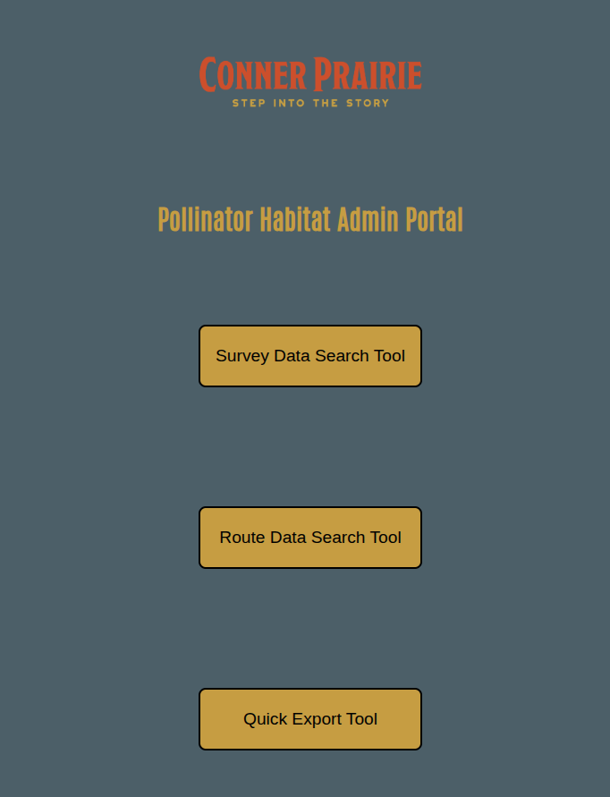

To chose an option, simply click it. You can always go back to the menu page with the "Back to Portal Menu" button that is at the top of each page.

### Searching

To search the database with either the survey response data tool or the route data tool, there are 3 types of search criteria that could be provided:

#### 1: By date
#### 2: By date range 
#### 3: By sessionID 

### Search by date

#### 1: Enter in the desired search date in the "Start Date" textbox. 
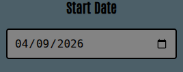

#### 2: Click the 'Search' button to obtain results pertaining to the entered date value.

### Search by Date Range

#### 1: Click the "Date Range" checkbox so it fills in orange. This activates the second search box. 

#### 2: Search by date: Enter in the desired search dates in the "Start Date" and "End Date" textboxes. 
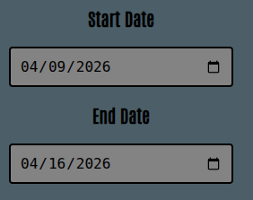

#### 3: Click the 'Search' button to obtain results pertaining to the entered date range values.

### Search by SessionId (single session result)
Searching by sessionID is a great way to get an aggregated view of an entire session, instead of responses being listed individually. 

#### 1: Enter in the desired search date in the "Start Date" textbox. 
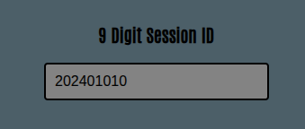

#### 2: Click the 'Search' button to obtain results pertaining to the entered SessionId value. 

### Viewing Results

The results for both search tools are different, as they request different data values from the database. 

The Survey Data Tool provides access to 2 values: 
- Number of adults
- Number of children
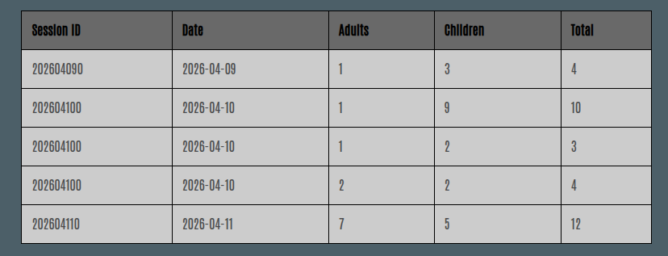

The Route Data Tool provides access to 3 tables: 
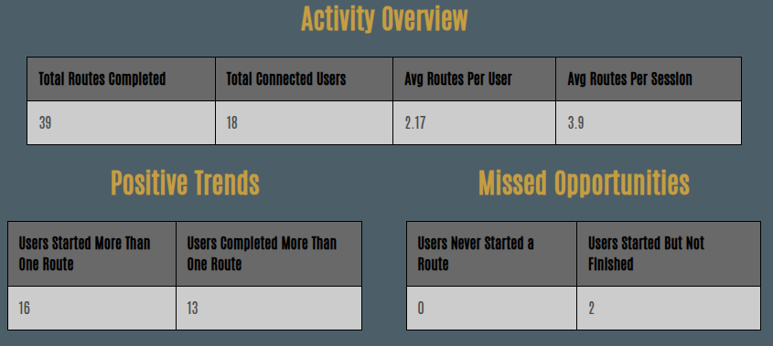

#### 1: Activity Overview
- Number of connected users
- Number of completed routes
- Average routes completed per user
- Average routes completed per session

#### 2: Positive Trends
- Users started more than one route
- Users completed more than one route

#### 3: Missed Opportunities
- Users that didn't complete a route
- Connected users that didn't start a route

### Clearing
To reset the table and clear any search results, click the "Clear Table" button. 

To reset the search boxes, whether they are date or sessionID, use the "Clear Search" button. 

### Export 
A button to export to CSV is available in both search tools. As long as a valid search result has been returned and is visible in the table, the export button should become enabled. Clicking the button will allow for a CSV report of the current search results to be saved for archival, research, or other organizational purposes. 

The export button will be disabled unless a valid response is received from the search request, as shown in the picture below.

When a valid response is received by the portal, the button becomes enabled. 

## Quick Export Tool 

The third and final tool in the portal is the Quick Export Tool, which allows for quick exporting of reports containing data from a timespan chosen by the user. Timespan options:
- Last month
- Last 3 months
- Last 6 months
- Last year
- Last 3 years
- All Time (start date Jan 1, 2020)

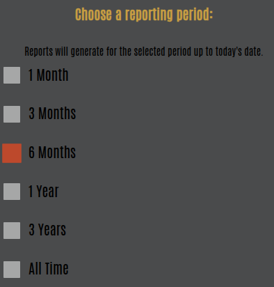

The report type is also chosen by the user. Report options:
- Survey data
- Route Data

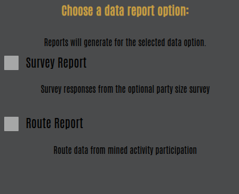

One option should be selected for both categories. Select the option by simply clicking the checkbox. When options are set to the desired report criteria, click the "Export Data" button to receive the ability to save the database results as a CSV file. 

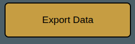