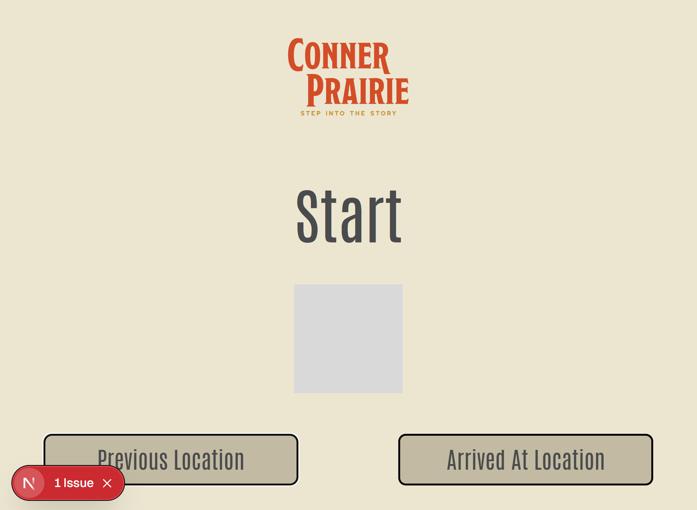
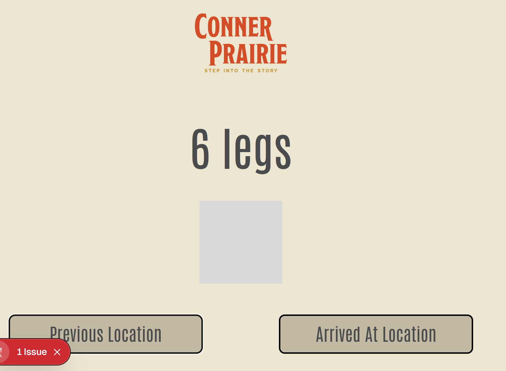

# User Documentation 

## Pollinator Habitat Activity
### Overview

This application is designed to be your virtual fact sheet for **Conner Prairie's: *Pollinator Habitat*** Activity. When you begin, you will secretly be assigned a random pollinator. The purpose of the activity is to use **science** to figure out what polliator *you* are. 

This is completed by going through a small series of prompts ("I have 2 legs", "I have 4 wings") that you will follow along with by matching it with the clues on your screen (ex: 6 legs or elytra wings) 

At every prompt, you will use your pollinators physical characteristics to narrow down what type of pollinator you were secretly assigned (ex: "Bee", "Hummingbird").

Once you have ruled out any other type of pollinator, you will discover which one you were secretly assigned. You will then be presented unique facts about that particular pollinator, and its benefit to the ecosystem!

**Fun fact: The activity's series of questions are called a dichotomous key.**

You can learn more about dichotomous keys here: [biologydicionary.net](https://biologydicionary.net)

### Usage Guide: 

**Note:** Let the application load completely. If it says "loading..." in the center of your screen, check your internet connection. 

When you see the word "Start" on your screen, you have successfully joined the activity and been assigned a secret pollinator. An example of this screen is shown in the picture below:

#### 1: With Start on your screen, move to the Start Card along the ground. 

#### 2: Once at the Start location, press the "Arrived At Location" button to get your first pollinator clue. Then, move to the spot that matches your pollinator's clue. 

##### Example: If your screen displays the clue "6 legs" move to the spot that has the "6 legs" card. 

#### 3: Once you arrive to the spot, press the "Arrived At Location" button to move get your next fact so you can figure out where to go next. 

#### 4: Follow along until you figure out your unique pollinator. You will then get to view a small bio about your pollinator to learn even more about them!

#### 5: Once you have read all about your pollinator, you can restart the activity with a new pollinator by pressing the "Start New Route" button on the last fact page of the current pollinator. After pressing, go back to step 1 to repeat the activity! 

## Pollinator Habitat Admin Portal 
### Overview
This application is designed to be a quick search tool to retreive party size survey responses and results from the database. With the ability to search by date, date range, or session ID number, the portal provides various ways to access survey response data. 

This data can also be exported to CSV (at the request of our client) so that it can shared with stakeholders or archived for collection purposes. 

### Usage Guide: 

The portal page is a single page application designed to allow the access and export of survey data based on the search criteria. 
Data is grouped by SessionID within the database. 

#### Search by Date

#### 1: Enter in the desired search date in the "Start Date" textbox. 
(pic here)

#### 2: Click the 'Search' button to obtain results pertaining to the entered date value. 
(pic here)

#### Search by Date Range

#### 1: Click the "Date Range" checkbox so it fills in orange. This activates the second search box. 
(Pic here) (after pic here)

#### 2: Search by date: Enter in the desired search dates in the "Start Date" and "End Date" textboxes. 
(Pic here)

#### 3: Click the 'Search' button to obtain results pertaining to the entered date range values.
(Pic here)

#### Search by SessionId (Single result table row)

#### 1: Enter in the desired search date in the "Start Date" textbox. 
(pic here)

#### 2: Click the 'Search' button to obtain results pertaining to the entered SessionId value. 
(pic here)

#### Export Search Results

#### 1: Have a valid search result within the table, can complete any of the previous 3 search types. 

#### 2: Click the 'Export' button to export a CSV to your browswer. 
(pic here)
(result pic)

